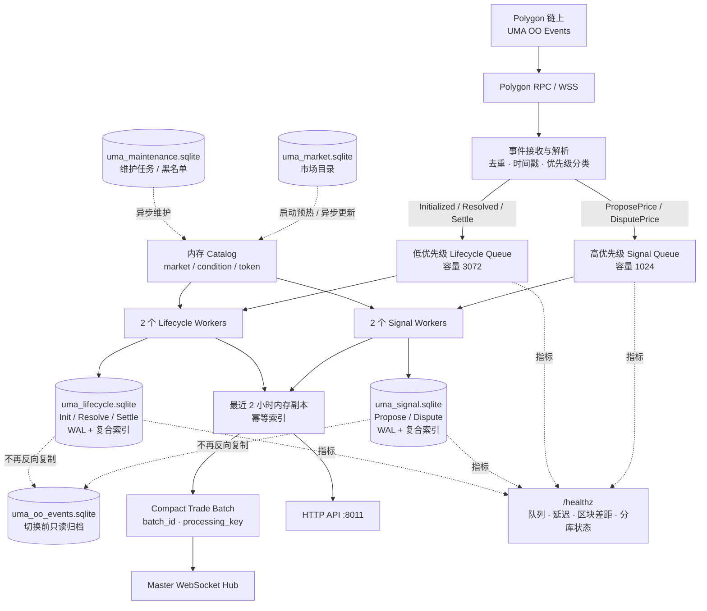
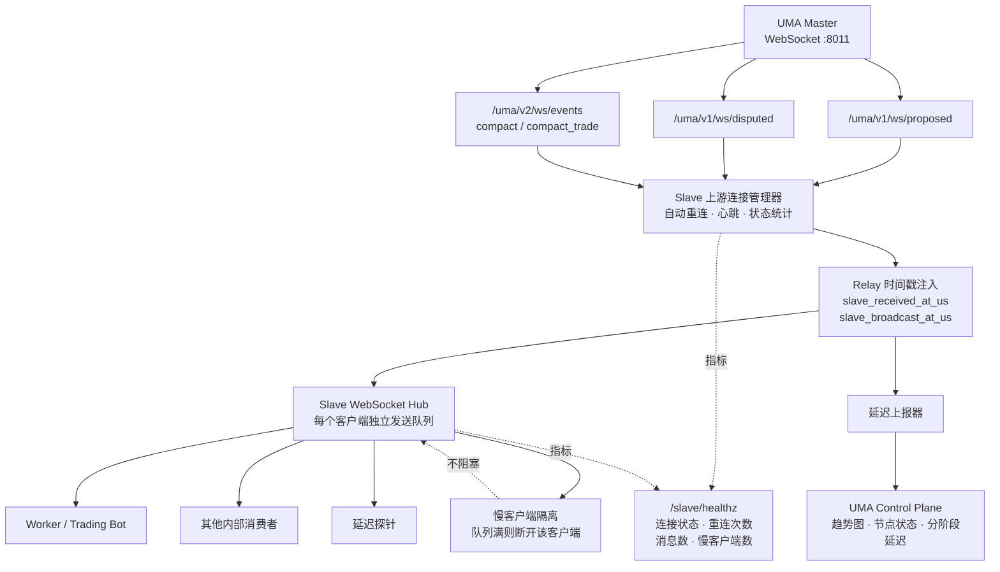
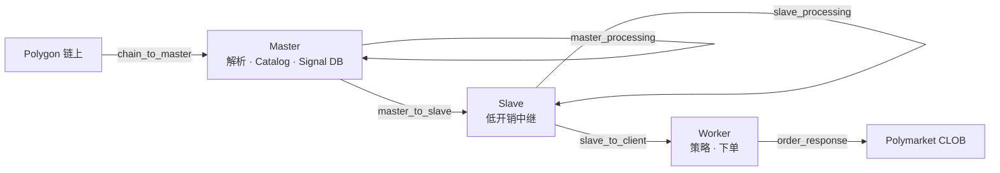

# UMA Master / Slave 当前架构

> 更新日期：2026-08-06

## Master 架构



Master 的 ProposePrice 关键路径：

```text
链上事件
  → Master 接收
  → Signal 高优先队列
  → 内存 Catalog 查询
  → uma_signal.sqlite 持久化
  → 内存副本
  → WebSocket 广播
```

ProposePrice 热路径不同步请求 Gamma，也不再反向写入旧事件库。信号库使用 WAL，并通过 `(timestamp, transaction_hash, log_index)` 复合索引避免计算 `cursor_id` 时全表扫描。

## Slave 架构



Slave 关键路径：

```text
Master WSS
  → Slave 上游连接
  → 注入接收/广播时间戳
  → Slave WebSocket Hub
  → Worker 独立发送队列
```

Slave 不执行 Gamma 查询、SQLite 持久化或交易业务判断，主要负责低开销转发、客户端隔离和延迟采集。单个慢 Worker 不会阻塞其他 Worker。

## 端到端链路



## 关键监控指标

- `chain_to_master`
- Master ProposePrice `queue_ms`
- Master ProposePrice `sqlite_ms`
- `master_to_worker_delay_ms`
- `order_response_ms`
- `order_verify_ms`
